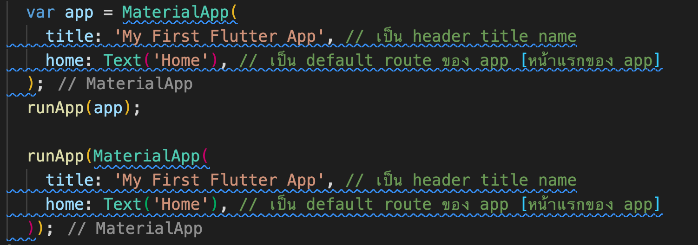
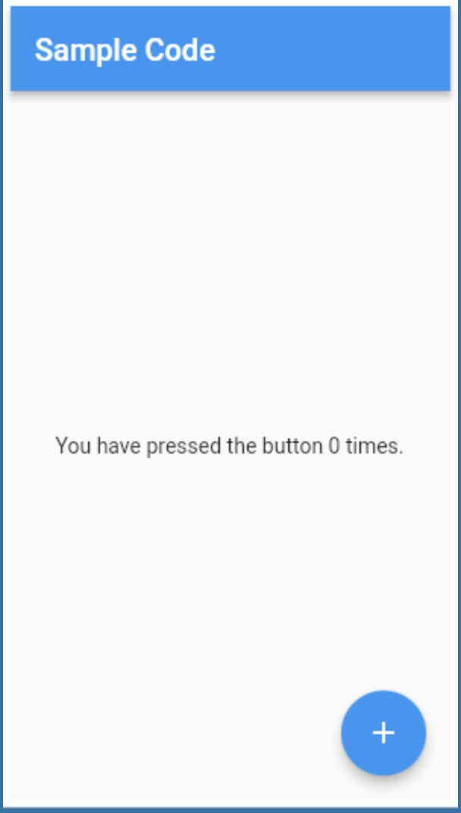
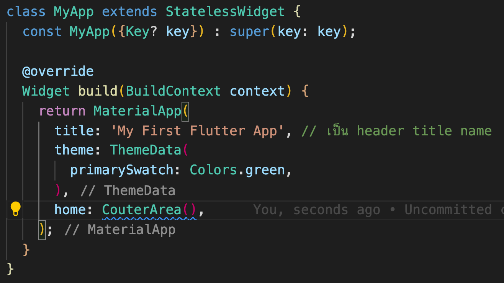
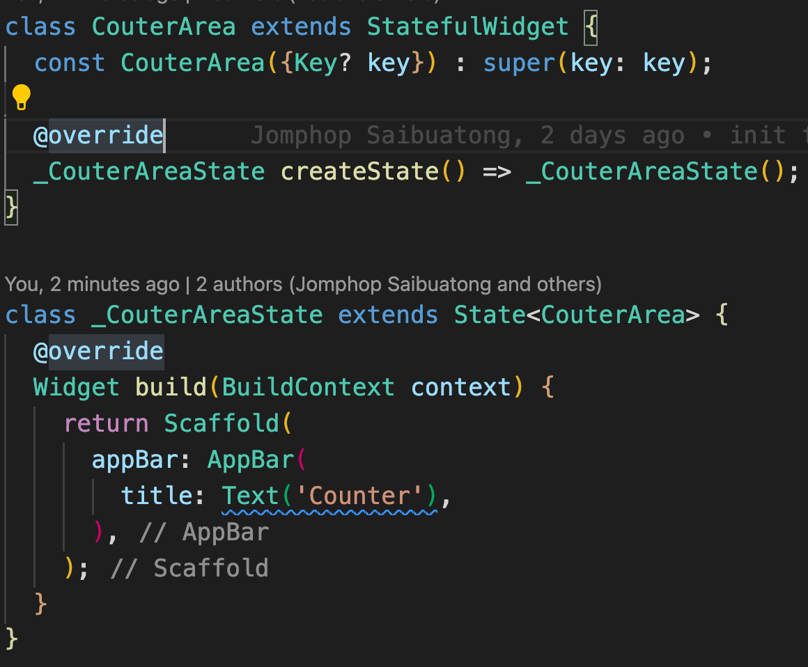

# **FlutterDojo**

## **Trick**
- `url_launcher` => เป็น plugin ที่ทำให้สามารถโทรออกได้

## **Commands**

- flutter create `name project` => create project flutter

## **Structure Project Flutter**

1. lib => เป็น folder ที่เอาไว้เก็บไฟล์ widget ทั้งหมดที่เป็น dart โดยมี main.dart เป็น entry point ของ project
2. pubspec.yaml => เป็นเหมือนไฟล์ package.json ของฝั่ง nodejs ที่จะเก็บพวกรายละเอียดพวก config ต่างๆ, package library ที่ลงใน project flutter นี้
3. folder android and ios => เป็นที่ๆ project app ของแต่ละระบบจะถูกสร้างเก็บไว้ ซึ่งจะเอาไว้แก้ไขอะไรก็ตามที่เฉพาะทางของแต่ละระบบ

`Note : ` https://pub.dev/ => เว็บรวม Package สำหรับ Flutter เช่น flutter icon เอาไว้ทำ icon สำหรับ ios, android

## **Widget**

    flutter ถูกออกแบบมาเพื่อจัดการ UI โดยมีแนวคิดในการแบ่ง UI ออกเป็นชิ้นเล็กๆ ที่เรียกว่า `Widget`

    แบ่ง widget ออกเป็น 2 แบบ
    1. widget แบบที่เป็นชิ้นเล็กๆ เช่น app bar, button, รูปภาพ เป็นต้น
    2. widget ที่เรามองไม่เห็นแต่จำเป็นต่อการใช้งานพวก layout ในการจัดการตำแหน่ง เช่น column, row เป็นต้น

`Note :` ภายใน widget เราสามารถกำหนด property เช่น สีtext, สีพื้นหลัง, ขนาดตัวอักษร เป็นต้น หรือ สามารถใช้ widget ซ้อนใน widget อีกทีได้(เป็นการกำหนด property ด้วย widget)

`Note : ` runApp(`widget`) เป็น method ที่เอาไว้ render root widget ที่จะทำงานที่ `main.dart`

`Note :` โดยปกติการ instance widget แบบเก่าจะต้องมีการใช้ new keyword ด้วย แต่ใน dart ตั้งแต่เวอร์ชั่น 2.0 เป็นต้นไป ไม่จำเป็นต้องใช้ new keyword ในการ instance widget ก็ได้

### MaterialApp

-> เป็น widget ตัวนึงของ flutter ที่จะสามารถสร้าง ui ของ app ขึ้นมาได้

`Note : ` เขียนได้ 2 แบบ

### Scaffold

-> เป็น widget สำเร็จรูปที่เอาไว้สร้างหน้าตา ui(`appBar, body, floatingActionButton`)

### Stateless,Stateful widget

1. `Stateless` -> เป็น widget ที่ load ขึ้นมาครั้งเดียวแล้วไม่มีการเปลี่ยนแปลงอีก เป็น widget ที่มี state เดียว เช่น Text, Scaffold, Icon, เป็นต้น

`Note : ` stateless จะมีการ build render เพียงแค่ครั้งเดียว

2. `Stateful` -> เป็น widget ที่มีหลาย state เช่น ตอนโหลดข้อมูลจะมีตัว loading spin แล้วพอข้อมูลโหลดเสร็จก็จะแสดง list รายการข้อมูล, checkbox, slider, text input field เป็นต้น

`Note : ` stateful จะสามารถ build render ได้หลายครั้ง โดยผ่านคำสั่ง `setState(() {})` ที่จะเป็นการบอกกับ app ว่าตัวแปรใน widget นี้มีการเปลี่ยนแปลง

`Note :` stateless,stateful มี method build สำหรับ render ui

### Center

-> เป็น widget ที่เอาไว้จัดการ widget ตัวอื่นให้อยู่ตรงกลางทั้งแนวนอน แนวตั้ง (ซึ่งจะรับ widget ได้แค่ตัวเดียว)

### Column

-> เป็น widget ที่เอาจัดการ layout ให้ widget เรียงลงมาตามแนวตั้ง (ซึ่งจะรับ widget ได้มากกว่า 1)
-> มี property mainAxisAlignment,crossAxisAlignment ในการจัดตำแหน่ง layout ตามแนว

### ListView

-> เป็น Widget ที่เอาไว้สำหรับจัดเรียงข้อมูล list ที่เรียงจากบนลงล่าง
-> ListTile เป็นเหมือนก้อน object ข้อมูลสำหรับ render ใน ListView
-> สามารถ auto generate ListView ได้ด้วยการใช้ ListView.builder

### Image

-> เป็น Widget สำหรับรูปจะมี constructure method อยู่ 4 ตัว
- `asset()`
- `network()`
- `file()`
- `memory()`
